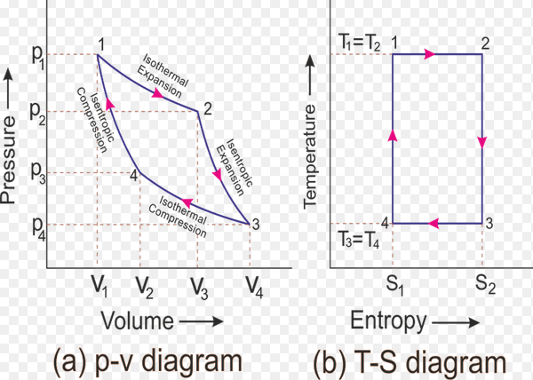

\maketitle
\tableofcontents
\newpage

# Naloga

$1 kg$ zraka ekspandira od tlaka $4 bar$ in temperature $25^\circ C$ na tlak $2 bar$:

* izohorno
* izotermno
* izotropno
* politropno

Kolikšna je končna temperatura? Kolikšno je opravljeno delo? Kolikšna je dovedena oziroma odvedena toplota?

## Podatki

$m = 1kg$ \
$p_1 = 4 bar = 4 * 10^5 Pa$ \
$t_1 = 25^\circ C \Rightarrow T_1 = 298,15 K$ \
$p_2 = 2 bar = 2 * 10^5 Pa$

## Izračun

$c_v = 718 \frac{J}{kgK}$ \
$R_{z} = 287 \frac{J}{kgK}$

### Izohora

Volumsko delo $W_{12}$ je 0.

$$
\frac{T_1}{T_2} = \frac{p_1}{p_2} \Rightarrow T_2 = \frac{p_2 T_1}{p_1} = \frac{2*10^5 Pa * 298,15K}{4*10^5} = 149,1K
$$

$$
w_{12} = \cancel{0}
$$

$$
pV = mRT \Rightarrow V = \frac{mRT}{p} = \frac{1kg * 287 \frac{J}{kgK} * 298,15K}{4*10^5 Pa} = 0,21 m^3
$$

$$
W_{t12} = V(p_1 - p_2) = 0,21*(4*10^5 Pa - 2*10^5 Pa) = 420000 J
$$

$$
Q_{12} = m c_v (T_2 - T_1) = 1 kg * 718 \frac{J}{kgK} * (149,1 K - 298,15 K) = -107017,9 J
$$

### Izoterma

Tehnično delo je enako volumskemu: $W_{t12} = W_{12}$, temperatura pa je konstantna: $T_1 = T_2 = 298,15 K$, toplota je enaka volumskemu delu, ker je sprememba notranje energije enaka 0.

$$
w_{12} = RT\ln{\frac{p_1}{p_2}} = 287 \frac{J}{kgK} * 298,15 K * \ln{\frac{4*10^5 Pa}{2*10^5 Pa}} = 59311,9 \frac{J}{kg}
$$

$$
W_{12} = m * w_{12} = 1kg * 59311,9 \frac{J}{kg} = 59311,9 J
$$

$$
W_{t12} = W_{12} = 59311,9 J
$$

$$
Q_{12} = W_{t12} = 59311,9 J
$$

### Izotropa

$\kappa = 1,4$

$$
\frac{T_1}{T_2} = (\frac{p_1}{p_2})^{\frac{\kappa-1}{\kappa}} \Rightarrow T_2 = \frac{T_1}{(\frac{p_1}{p_2})^{\frac{\kappa - 1}{\kappa}}} = \frac{298,15 K}{(\frac{4*10^5 Pa}{2*10^5 Pa})^{\frac{1,4 - 1}{1,4}}} = 244,58 K
$$

$$
w_{12} = c_v (T_1 - T_2) = 718 \frac{J}{kgK} * (298,15K - 244,58 K) = 38463,3 \frac{J}{kg}
$$

$$
W_{12} = m * W_{12} = 1kg * 38463,3 \frac{J}{kg} = 38463,3 J
$$

$$
W_{t12} = W_{12} * \kappa = 38463,3 \frac{J}{kg} * 1,4 = 53848,56 J
$$

$$
q_{12} = \cancel{0}
$$

### Politropa

$\kappa = 1,4$ \
$n = 1,2$

$$
\frac{T_1}{T_2} = (\frac{p_1}{p_2})^{\frac{n-1}{n}} \Rightarrow T_2 = \frac{T_1}{(\frac{p_1}{p_2})^{\frac{n - 1}{n}}} = \frac{298,15 K}{(\frac{4*10^5 Pa}{2*10^5 Pa})^{\frac{1,2 - 1}{1,2}}} = 265,62 K
$$

$$
w_{12} = c_v * \frac{\kappa - 1}{n - 1}(T_2 - T_1) = 718 \frac{J}{kgK} * \frac{1,4 - 1}{1,2 - 1}*(298,15K - 265,62K) = 46713 \frac{J}{kg}
$$

$$
W_{12} = m * w_{12} = 1 kg * 46713 \frac{J}{kg} = 46713 J
$$

$$
W_{t12} = n * W_{12} = 1,2 * 46713 J = 56052,07 J
$$

$$
q_{12} = c_v \frac{n - \kappa}{n - 1}(T_2 - T_1) = 718 \frac{J}{kgK} \frac{1,2 - 1,4}{1,2 - 1}(265,62 K - 298,15 K) = 23356,5 \frac{J}{kg}
$$

$$
Q_{12} = m * q_{12} = 1 kg * 23356,5 \frac{J}{kg} = 23356,5 J
$$

# Naloga

Za batni kompresor imamo naslednje podatke:

$V_1 = 4 dm^3 = 4 * 10^{-3}m^3$ \
$t_1 = -3^\circ C \rightarrow T_1 = 270,15 K$ \
$p_1 = 1 bar = 10^5 Pa$

Pri stiskanju zraka v rezervoar s prostornino $V_2 = 1,5 m^3$ in temperaturo $t_2 = 45^\circ C \rightarrow T_2 = 318,15 K$, dosežemo tlak $p_2 = 2 bar$. Koliko nihajev (obratov) bata je potrebno, da dobimo tlak v rezervarju 2 bara, če je začetni tlak $p_2' = 1 bar$.

$$
p_1 V_1 = \underline{m_1} R_z T_1
$$

Masa zraka pri enem obratu bata:

$$
m_1 = \frac{p_1 V_1}{R_z T_1} = \frac{10^5 Pa * 4*10^{-3} m^3}{287 \frac{J}{kgK} * 270,15 K} = 0,005159 kg
$$

Skupna masa zraka v rezervoarju:

$$
m_2 = \frac{p_2 V_2}{R_z T_2} = \frac{2*10^5 Pa * 1,5 m^3}{287 \frac{J}{kgK} * 318,15 K} = 3,285545 kg
$$

$n$ je število obratov bata:

$$
m_2 = m_1 * n \rightarrow n = \frac{m_2}{m_1} = \frac{3,285545 kg}{0,005159 kg} = 636.857 \approx 637
$$

Za pridobitev potrebnega tlaka v rezervarju potrebujemo 637 nihajev bata.

# Naloga

$1 kg$ zraka s tlakom $1 bar$ in $15^\circ C$ komprimiramo izentropno na $8 bar$. Koliko dela potrebujemo? Kolikšen je končen volumen in temperatura?

$m = 1 kg$ \
$p_1 = 1 bar = 10^5 Pa$ \
$t_1 = 15^\circ C \rightarrow T_1 = 288,15 K$ \
$p_2 = 8 bar = 8*10^5 Pa$ \
$W, V_2, T_2 = ?$

$$
\frac{T_1}{T_2} = (\frac{p_1}{p_2})^\frac{k-1}{k} \rightarrow T_2 = \frac{T_1}{(\frac{p_1}{p_2})^\frac{k-1}{k}} = \frac{288,15 K}{(\frac{10^5 Pa}{8*10^5 Pa}^\frac{1,4-1}{1,4})} = 521,97 K
$$

$$
p_2 V_2 = m R_z T_2 \rightarrow V_2 = \frac{m R_z T_2}{p_2} = \frac{1 kg * 287 \frac{J}{kgK} * 521,97 K}{8*10^5 Pa} = 0,187 m^3
$$

$$
w_{12} = c_v(T_2 - T_1) = 718 \frac{J}{kgK} * (521,97 K - 288,15 K) = 167882,76 \frac{J}{kg} 
$$

$$
W_{12} = w_{12} * m = 167882,76 \frac{J}{kg} * 1 kg = \underline{167882,76 J}
$$

# Naloga

Z $1 m^3$ zraka s tlakom $1 bar$ in temperaturo $20^\circ C$ izvajamo Carnotov krožni proces. Zrak izotermno komprimiramo do $5 bar$, potem pa izentropno do $50 bar$. Določite veličine stanja v karakterističnih točkah procesa, izmenjane toplote, termodinamični izkoristek in pridobljeno delo.

$V_1 = 1 m^3$ \
$p_1 = 1 bar = 10^5 Pa$ \
$t_1 = 20^\circ C \rightarrow T_1 = 293,15 K$ \
$p_2 = 5 bar = 5*10^5 Pa$ \
$p_3 = 50 bar = 50*10^5 Pa$

| | p [$Pa$] | V [$m^3$] | T [$K$] |
| --- | --- | --- | --- |
| 1. | $10^5$ |  | $293,15$ |
| 2. | $5*10^5$ |  | $293,15$ |
| 3. | $50*10^5$ |  | $565,98$ |
| 4. |  |  | $565,98$ |

**1-2 izoterma**

$$
T_1 = T_2
$$

**2-3 izentropa**

$$
\frac{T_1}{T_2} = (\frac{p_1}{p_2})^\frac{k-1}{k} \rightarrow T_2 = \frac{T_1}{(\frac{p_1}{p_2})^\frac{k-1}{k}} = \frac{293,15 K}{(\frac{5*10^5 Pa}{50*10^5 Pa}^\frac{1,4-1}{1,4})} = 565.98 K
$$

**3-4 izoterma**

$$
T_3 = T_4
$$

**4-1**

???

**!!DOKONČAJ!!**

# Naloga

Pri krožnem procesu naj bo dovedena toplota $2 \frac{MJ}{kg}$. Toplota naj se odvaja pri konstantni temperaturi $300 K$. Ekspanzija in kompresija sta izentropni. Toploto dovajamo pri konstantni temperaturi $2500 K$. Kolikšen je termodinamični izkoristek?

