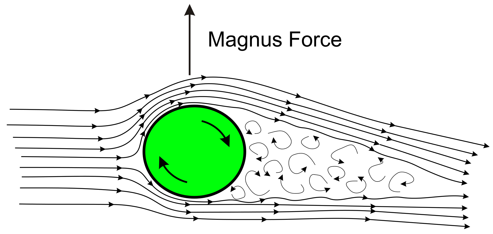

### Kdaj se telo giblje?

Kadar se njegova pot spreminja po času -> $v=\frac{s}{t}$

### Kakšno gibanje je vodoravni met?

Sestavljeno gibanje. V vodoravni smeri iz enakomernega premega gibanja, v navpični pa iz enakomerno pospešenega gibanja.

### Definirajte obodno in kotno hitrost

Obodna - hitrost na obodu kroženja [$\frac{m}{s}$]

Kotna - meri zasuk pri vrtenju v časovni enoti [$\frac{rad}{s^{-1}}$] ali [$s^{-1}$]

### Definirajte pospešek pri kroženju

Pospešek pri kroženju ima v splošnem radialno in tangencialno komponento, pri enakomernem kroženju pa je tangencialna komponenta enaka nič. Radialni pospešek pri kroženju je enak

$$ a_r = \omega^2 r$$

Tangencialni pospešek je zmnožek kotnega pospeška in polmera kroženja:

$$a t = \alpha r$$

### Kako obravnavamo splošno krivo gibanje (kaj računamo?)

Krívo gibanje je takšno gibanje telesa, pri katerem opiše tir telesa krivuljo v prostoru. Zgledi za krivo gibanje so denimo kroženje, poševni met, nihanje ali precesija. Krivo gibanje je vedno pospešeno, saj je za spremembo smeri gibanja potreben pospešek v smeri, prečno na smer gibanja. 

V vsaki točki je gibanje enako gibanju po krožnici, funkcija gibanja pa more biti dvakrat odvedljiva.
Računamo krivinski radij, včasih še hitrost in pospešek.

### Kako pridemo do radialnega pospeška

Radialni ali centripetalni pospešek je komponenta vektorja pospeška prečno na smer gibanja, ki povzroči, da se vektor hitrosti spremeni po smeri, na njegovo velikost pa nima vpliva.

Izračunamo ga kot zmnožek kvadrata kotne hitrosti $\omega$ in radija kroženja $r$:
$${\displaystyle a_{r}=\omega ^{2}r\!\,,}$$

### Kakšno gibanje je nihanje

Níhanje je periodično gibanje, ki se ga lahko opredeli z amplitudo ter frekvenco ali nihajnim časom. Navadno se obravnava sinusno nihanje, pri katerem se odmik ali odklon sinusno spreminjata s časom.

* Amplituda nihanja je največji odmik ali odklon
* Nihajni čas ali perioda je čas, ki ga nihalo potrebuje za gibanje med dvema zaporednima ustreznima odmikoma ali odklonoma 
* Frekvenca pa je število nihajev na sekundo.

$$ X = X_0 \sin{\omega t + \delta}$$

### Viskoznost

Trenje med tekočino in površino po kateri teče in med posameznimi delci tekočine.

### Linijske in lokalne izgube

Linijske: $\Delta p = \lambda \frac{l}{d} \frac{\rho v^2}{2}$

Lokalne: $\Delta p = \sum\frac{\rho v^2}{2}$

### Navier-Stokesove enačbe

So sistem nelinearnih parcialnih diferencialnih enačb, ki opisujejo nestacionarno gibanje stisljive newtonske viskozne tekočine. 

Če viskozne sile zanemarimo, uporabimo Eulerjevo enačbo

### Eulerjeva enačba

Potencialni tlak (ne upošteva viskoznosti niti vrtinčenja)

$$ \Delta \psi = 0 $$

### Razlika med laminarnim in turbolentnim tokom

Laminarni tok je tok snovi, pri katerem so tokovnice urejene in gladke. Pri laminarnem toku je pomembna viskoznost snovi.

Turbulentni tok je nestacionarni tok tekočine, pri katerem se tokovnice s časom premikajo, iz njih pa se lahko ustvarjajo vrtinci.

### Magnusov efekt

Opazi se, ko imamo vrteči se predmet, ki se giblje skozi tekočino. Pot predmeta ko se vrti je drugačna od istega predmeta, če se ta nebi vrtel. Do te spremembe pride zaradi razlike pritiska med nasprotnimi stranmi predmeta. 

Na eni strani, se površina predmeta giblje hitreje kot tekočina in jo zato tik ob površini pospeši, na drugi strani pa pride do nasprotnega efekta.

### Kaj je kinetična energija

Kinetična energíja je energija, ki jo ima telo zaradi svojega gibanja. Izračunamo jo lahko kot delo, potrebno, da telo spravimo v gibanje.

$$W_k= {mv^2 \over 2} $$

### Kaj je potencialna energija

Potencielna energíja je energija, ki jo ima telo zaradi svoje lege v polju sil. Potencialna energija se zmanjša, če se telo premakne v smeri sile, ki deluje nanj, in poveča, če se premakne v nasprotni smeri.

$$ W_p = mgh $$

### Kaj je prožnostna energija

Ker je sila vzmeti konservativna, lahko tudi prožnostno energijo obravnavamo kot vrsto potencialne energije. Za vijačno vzmet, za katero velja Hookov zakon, lahko zapišemo:

$$  W_{pr} = {kx^{2} \over 2} $$

### Zakon o ohranitvi energije

Kadar je delo vseh zunanjih sil enako nič, se energija v sistemu ohranja.

### Steinerjev izrek

Steinerjev izrek podaja masni vztrajnostni moment $J$ togega telesa okrog dane osi vrtenja:

$$ J^\star = J + mr^2 $$

### Kako se spreminja tlak v tekočini

Spreminja se linearno: $p = \rho g h$ 

### Sila vzgona

Slia vzgona je enaka teži izpodrinjene tekočine

### Barometerska enačba

Barometrska enečba opisuje pojemanje tlaka $p$, z višino $z$ v izotermnem ozračju:

$$p(z) = p_0e^{-z \over z_0}$$

V realnem ozračju se temperatura z višino spreminja, zato velja ta zveza le približno.

### Površinska napetost

Površinska napetost je pojav, da se gladina kapljevine obnaša kot prožna plošča. Posledica tega je, da se kapljevine zberejo v kapljice, kot tudi kapilarnost, pojav, da se kapljevina, ki moči podlago, vzpne po stenah ozke cevke.

Površinska napetost je posledica privlačnih van der Waalsovih sil med molekulami kapljevine.

### Bernoullijeva enačba

Bernoullijeva enačba opisuje stacionarni laminarni tok nestisljive in neviskozne tekočine vzdolž tokovnice:

$${\rho v^2 \over 2} + \rho gh+p =konst$$

Je enačba o ohranitvi energije pri gibanju tekočine, če zanemarimo viskoznost in predpostavimo laminarni tok

### Newtonovi zakoni

Newtonovi zakoni gibanja so:

1. Če telo miruje ali se giblje premo enakomerno, nanj ne deluje nobena sila ali pa je vsota vseh sil, ki delujejo nanj enaka nič.
2. Pospešek telesa je premo sorazmeren z rezultanto sil na telo in obratno sorazmeren z maso telesa. ($F = ma$)
3. Če prvo telo deluje na drugo telo s silo, deluje to na prvo z enako veliko, a nasprotno usmerjeno silo (akcija reakcija).

### Kdaj nastaja Coriolisova sila

Coriolisova sila je sila, ki povzroča odklon, oziroma ukrivljenje gibajočih teles z vidika opazovalca, ki se nahaja v vrtečem se sistemu. Coriolisova sila se pojavlja zgolj v primerih, kjer se opazovani sistem vrti.

### Kako definiramo moment

Navor ali moment je v fiziki količina, ki nastopa pri kroženju točkastega telesa in vrtenju togega telesa. Enaka je produktu sile in razdalje premice sile od osi. 

### Kam kaže navor

Usmerjen je v smeri vektorskega produkta ročice in sile.
Z desno roko objamemo predmet (npr. izvijač) in ga zavrtimo v obratni smeri urinega kazalca. Iztegnjen palec kaže smer pozitivnega navora.

### Kako definiramo gibalno količino

Gibalna količína je fizikalna količina, enaka zmnožku mase in hitrosti točkastega telesa. Pri razsežnem telesu se upošteva hitrost težišča.

$${\displaystyle {\vec {\mathbf {G} }}=m{\vec {\mathbf {v} }}\!\,.}$$

Izrek o gibalni količini pove, da je skupni sunek zunanjih sil enak spremembi gibalne količine.

$${\displaystyle {\vec {\mathbf {F} }}={\frac {\mathrm {d} {\vec {\mathbf {G} }}}{\mathrm {d} t}}\!\,.}$$

### Kakšni so trki in kaj se ohranja pri katerem

Trki med telesi so lahko:
* prožni
* neprožni
* delno prožni

Prožni trk je tisti trk, za katerega velja, da se ob trku ohrani celotna kinetična energija.

Neprožni trk je tisti trk, za katerega velja, da se telesi ob trku sprimeta. Kinetična energija teles, ki trčijo, se ne ohrani.

### Kako definiramo koeficient prožnosti

Ali vzmetni koeficient.

$${\displaystyle F=k\,\Delta l\!\,}$$

Je razmerje med silo, potrebno da stisnemo vzmet in njeninm skrčkom.

### Kako definiramo delo

Delo količina, ki meri prehajanje energije med telesi. Delo je skalarna količina, ki je po dogovoru pozitivna, če sistem delo prejme, in negativna, če ga odda. 