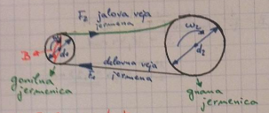
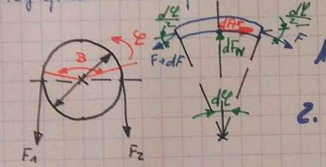

## Nadaljujemo z izračunom zobnika od prejšnje vaje

## Krogi za prvi zobnik (n = 15)

$$
\begin{aligned}
    d_1 &= {3*15 \over \cos{15 \deg}} \\
    d_1 &= 46.58743 mm
\end{aligned}
$$

$$
\begin{aligned}
    d_b &= 46.58743 * \cos{20.65 \deg} \\
    d_b &= 43.59428
\end{aligned}
$$

$$
\begin{aligned}
    d_w &= 46.58743 * {\cos{20.65 \deg} \over \cos{21.94577}} \\
    d_w &= 47.00000
\end{aligned}
$$

---
Ponoven izračun profilnih premikov

$$
\begin{aligned}
    \beta_b &= \arcsin{\sin{15\deg}*\cos{20\deg}} \\
    \beta_b &= 14.07609
\end{aligned}
$$

$$
\begin{aligned}
    z_{n1} &= {15 \over \cos^2{14.07809} * \cos{15\deg}}
    z_{n1} &= 16.50546
\end{aligned}
$$

$$
\begin{aligned}
    z_{n2} &= {45 \over \cos^2{14.07809} * \cos{15\deg}} \\
    z_{n2} &= 49.5164
\end{aligned}
$$

$$
\begin{aligned}
    z_{n1} + z_{n2} = {16.50546 + 495164 \over 2} = 33.01093
\end{aligned}
$$

$$
\begin{aligned}
    {x_1 + x_2 \over 2} = 0.141755
\end{aligned}
$$

Iz tabele odčitamo  $x_1=0.35$; $x_2=0.2835-0.35=-0.06649$.

---

Nadaljujemo izračun krogov

$$
\begin{aligned}
    d_f &= 46.58743 - 2 * (1.25 * 0.35 + 3) \\
    d_f &= 41.18743
\end{aligned}
$$

$$
\begin{aligned}
    d_2 &= {3 * 45 \over \cos{15\deg}} = 139.7623
\end{aligned}
$$

$$
\begin{aligned}
    k &= a - a_d - mn(x_1 + x_2) \\
    k &= 94mm - {d_1 + d_2 \over 2} - m_n(x_1+x_2) \\
    k &= 94 - {46.58743 + 139.7623 \over 2} - 3*(0.28351) \\
    k &= -0.025395
\end{aligned}
$$

$$
\begin{aligned}
    d_a &= 46.58743 + (3 + 0.35 * 3 -0.025395) \\
    d_a &= 50.61203
\end{aligned}
$$

---

Zaokrožitve
$$
\begin{aligned}
    \rho_{fp} &= {C_p \over 1 - \sin{\alpha}} \\
    \rho_{fp} &= {0.25 * 3 \over 1 - \sin{20\deg}} \\
    \rho_{fp} &= 1.1398
\end{aligned}
$$

### Krogi za drugi zobnik (n = 45)

$$
\begin{aligned}
    d &= {3*45 \over \cos{15 \deg}} \\
    d &= 139.7623 mm
\end{aligned}
$$

$$
\begin{aligned}
    d_b &= 139.7623 * \cos{20.65 \deg} \\
    d_b &= 130.78286
\end{aligned}
$$

$$
\begin{aligned}
    d_w &= 139.7623 * {\cos{20.65 \deg} \over \cos{21.94577}} \\
    d_w &= 140.99999
\end{aligned}
$$

$$
\begin{aligned}
    d_f &= 139.7623 - 2 * (1.25 * 0.35 + 0.06649 * 3) \\
    d_f &= 132.66124
\end{aligned}
$$

$$
\begin{aligned}
    d_a &= 139.7623 + (3 - 0.06649 * 3 -0.025395) \\
    d_a &= 142.53744
\end{aligned}
$$

### Izračun profilne stopnje prekrivanja zob

$$
\begin{aligned}
    \epsilon_\alpha &= {\sqrt{d_{a1}^2 - d_{b1}^2} + \sqrt{d_{a2}^2 - d_{b2}^2} - 2a*\sin{\alpha_{wt}} \over 2 m_t \pi \cos{\alpha_t}} \\
    \epsilon_\alpha &= {\sqrt{50.61241^2 - 43.59428^2} + \sqrt{142.53744^2 - 130.782857^2} - 2 * 94 *\sin{21.94577\deg} \over 2 * {3 \over \cos{15\deg}} \pi \cos{20.65\deg}} \\
    \epsilon_\alpha &= 0.66444
\end{aligned}
$$

### Bočna stopnja prekrivanja

$$
\begin{aligned}
    \epsilon_\beta &= {b_a * \sin{\beta} \over m_n * \pi} \\
    \epsilon_\beta &= {0.5 * 46.5874 * \sin{15\deg} \over 3 * \pi} \\
    \epsilon_\beta &= 0.63907
\end{aligned}
$$

### Skupna stopnja prekrivanja

$$
\begin{aligned}
    \epsilon &= \epsilon_\alpha + \epsilon_\beta = 0.66444 + 0.63907 \\
    \epsilon &= 1.3041
\end{aligned}
$$

### Za izris zobnikov potrebujemo še širino zob in širino zobne vrzeli

$s_t$ - ločna dolžina

$$
\begin{aligned}
    s_t = {P_t \over 2} + 2 * x * m_n * \tan{\alpha} = m_t * ({\pi \over 2} + 2 x * \tan{\alpha_n})
\end{aligned}
$$

$$
\begin{aligned}
    e_t = {P_t \over 2} - 2 * x * m_n * \tan{\alpha} = m_t * ({\pi \over 2} - 2 * x * \tan{\alpha_n})
\end{aligned}
$$

---
Drugi zobnik - x je negativen, zato se predznak spremeni v formuli

$$
\begin{aligned}
    s_t &= {3 \over \cos{15\deg}} * ({\pi \over 2} - 2 * 0.06649 \tan{20\deg}) \\
    s_t = 4.728299mm
\end{aligned}
$$

$$
\begin{aligned}
    e_t &= {3 \over \cos{15\deg}} * ({\pi \over 2} + 2 * 0.06649 * \tan{20\deg})
    e_t &= 5.028998 mm
\end{aligned}
$$

---

## Preračun gredi in ležajev
Za preračun gredi (notranji moment) in ležajev (reakcije) potrebujemo sile na zobnike

Falijo mi zapiski če če mogoče kdu poslat? :D

# Jermenska gonila

$B$ - objemni kot 

$F_1$ - sila v delovni veji

$F_2$ - sila v jalovi veji

$$
\begin{aligned}
    i = {d_2 \over d_1} = {\omega_1 \over \omega_2} = ({z_2 \over z_1}) && \text{samo pri zobatih jermenih in jermenica}
\end{aligned}
$$

Moment na jermenici:
$$
\begin{aligned}
    T = {F_1 - F_2 \over {d_q \over 2}}
\end{aligned}
$$

Razmerje sil na meji zdrsa:
$$
\begin{aligned}
    m = {F_1 \over F_2} = e^{uB}
\end{aligned}
$$

Poglejmo razmerje sil na meji zdrsa jermena:

$$
\begin{aligned}
    \sum F_{i\phi} = 0 \\
    dF_tr + F * \cancel{\cos{d\phi \over 2}} - (F + dF) * \cos{d\phi \over 2}
\end{aligned}
$$
