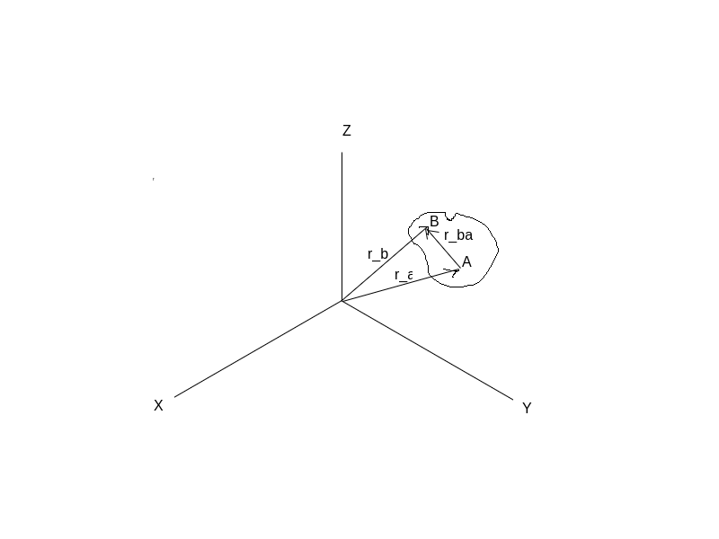
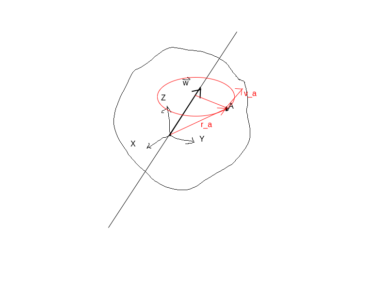
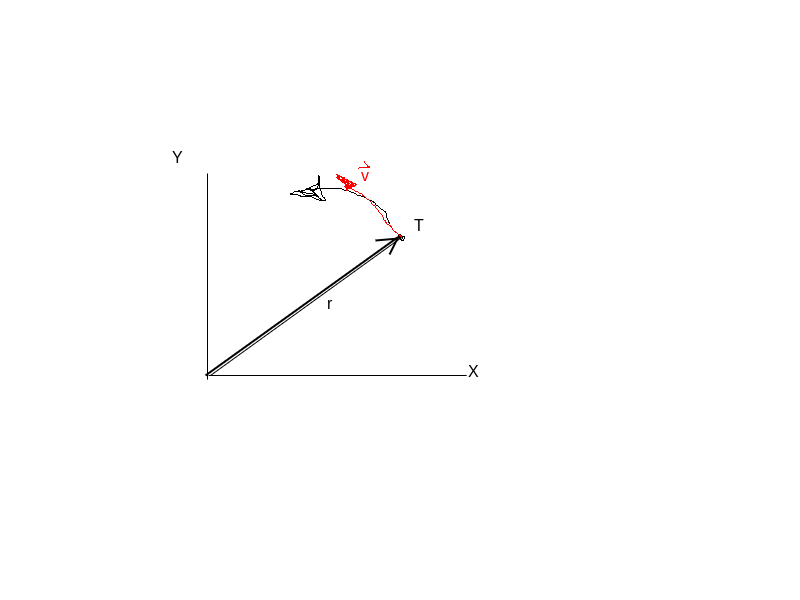
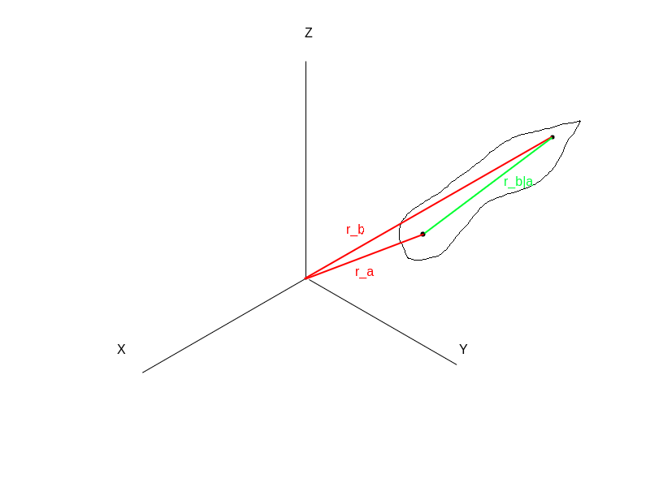

\maketitle
\tableofcontents
\newpage

# Mehanizmi

Mehanizmi so vse naprave, ki pretvarjajo gibanje.

Delitev mehanizmov glede na način prenosa gibanja:

* Vijačna gonila,
* ročični mehanizmi,
* torna gonila,
* krivuljni mehanizmi,
* jermenska in verižna gonila,
* zapiralni mehanizmi,
* zobniška gonila,
* koračni mehanizmi.

## Gonila z neenakomernim gibanjem

### Kinematika togih teles

{ width=8cm }

1. Poljubno gibanje v prostoru lahko razdelimo na translacijo in rotacijo. (**Končne rotacije niso aditivne**)

---

2. Za tranlacijo velja:
   * Poljubni dve točki na telesu (npr. A in B) imata enako hitrost in pospeške 

$$
\begin{aligned}
    \vec{r_B} &= \vec{r_B} + \vec{r_{B|A}} \\
    \vec{v_B} &= \vec{v_A} \\
    \vec{a_A} &= \vec{a_A}
\end{aligned}
$$

---

3. Enačbe za čisto rotacijo:
   

$$
\begin{aligned}
    \vec{v} &= \vec{\omega} \times \vec{r} \\
    \vec{a} &= {d \over dt} \vec{v} = {d \over dt} (\vec{\omega} \times \vec{r}) \\
    \vec{a} &= {d\vec{\omega} \over dt} \times \vec{r} + \vec{\omega} \times {d\vec{r} \over dt}\\
    \vec{a} &= \vec{\alpha} \times \vec{r} + \vec{\omega} \times \vec{v} \\
    \vec{\alpha} &= \vec{\alpha} \times \vec{r} + \vec{\omega} \times (\vec{\omega} \times \vec{r})
\end{aligned}
$$

* Poseben primer je rotacija v ravnini

Za hitrost:

$$
\vec{v} = \vec{\omega} \times \vec{r}
$$

če predpostavim

$$
\begin{aligned}
\vec{\omega} &= \omega * \vec{k} && ; && \vec{k} = \{0, 0, 1\} \\
\vec{r} &= \{r_x, r_y, 0\}
\end{aligned}
$$

dobimo vektor hitrosti

$$
\begin{aligned}
\vec{v} = \{v_x, v_y, 0\} && ; \\
\vec{v_x} = -\omega r_y \\
\vec{v_y} = +\omega r_x 
\end{aligned}
$$

Podobno za pospeške pri rotacijo v ravnini

$$
\begin{aligned}
    \vec{\alpha} &= \vec{\alpha} \times \vec{r} + \vec{\omega} \times (\vec{\omega} \times \vec{r}) \\
\end{aligned}
$$

ob predpostavki (vstavimo v zgornjo enačbo)

$$
\begin{aligned}
    \vec{\omega} &= \omega * \vec{k} &&;&& \vec{k} = \{0, 0, 1\} \\
    \vec{\omega} &= \{0, 0, \omega\} \\  
    \vec{r} &= \{r_x, r_y, 0\} \\
    \vec{\alpha} &= \{0, 0, \alpha\}\\
\end{aligned}
$$

dobimo

$$
\begin{aligned}
    a_x &= - \alpha r_y - \omega^2 r_x \\
    a_y &= + \alpha r_x - \omega^2 r_y
\end{aligned}
$$

Pospeške lahko razumemo tudi kot vsoto tangencialnega in radialnega pospeška:

$$
\begin{aligned}
\vec{a} &= \alpha * \vec{k} \times \vec{r} - \omega^2 \vec{r} \\
\vec{a_t} &= \alpha * \vec{k} \times \vec{r} \\
\vec{a_r} &= \omega^2 \vec{r} 
\end{aligned}
$$

---

1. Gibanje togega telesa lahko opišem kot vsoto translacije in rotacije

Za toga telesa velja, da če popišemo eno točko s translacijo, potem vse ostale točke glede na to točko zgolj rotirajo!

Za toga telesa v prostoru tako velja:

$$
\begin{aligned}
    \vec{r_B} &= \vec{r_A} + \vec{r_{B|A}} \\
    \vec{v_B} &= \vec{A} + \vec{\omega_{B|A}} \times \vec{r_{B|A}} \\
    \vec{a_B} &= \vec{a_B} + \vec{\alpha_{B|A}} \times \vec{r_{B|A}} + \vec{\omega_{B|A}} \times (\vec{\omega_{B|A}} \times \vec{r_{B|A}})
\end{aligned}
$$

V ravnini pa velja:

$$
\begin{aligned}
    v_{Bx} &= v_{Ax} - \omega_{B|A} * r_{B|Ay} \\
    v_{By} &= v_{Ay} + \omega_{B|A} * r_{B|Ax} \\
    a_{Bx} &= a_{Ax} - \alpha_{B|A} * r_{B|Ay} - \omega^2_{B|A} * r_{B|A x} \\
    a_{By} &= a_{Ay} + \alpha_{B|A} * r_{B|Ax} - \omega^2_{B|A} * r_{B|A y}
\end{aligned}
$$

## Primer 1

!!SLIKA!!

$v_a = 1 {m \over s}$ konstantno \
$\alpha = 30 \deg$ \
$l = 0.5 m$ \
$v_b = ?$

1. Izračunajte lege, hitrosti in pospeške točk A, B in C
2. Izračunajte lego točke B po $10^{-2} s$

Model:

!!SLIKA!!

$$
\begin{aligned}
    \vec{r_a} &= \lbrace 0, 0, 0 \rbrace \\
    \vec{r_b} &= \lbrace L * \cos{30 \deg}, L * \sin{30 \deg}, 0 \rbrace \\
    \vec{r_c} &= \lbrace \frac{L}{2} * \cos{30 \deg}, \frac{L}{2} * \sin{30\deg}, 0 \rbrace \\
\end{aligned}
$$

$$
\begin{aligned}
    \vec{r_{B|A}} &= \vec{r_b} - \vec{r_a} \\
    \vec{r_{B|A}} &= \vec{r_b}  && \text{ker je A v izhodišču} 
\end{aligned}
$$

$$
\begin{aligned}
    v_{Bx} &= v_{Ax} - \underline{\omega_{B|A}} * r_{B|Ay} \\
    \underline{v_{By}} &= v_{Ay} + \underline{\omega_{B|A}} * r_{B|Ax} \\
\end{aligned}
$$

vemo naslednje:

* $v_{Ax} = 1$
* $v_{Ay} = 0$
* $v_{Bx} = 0$
* $\vec{r_{B|Ax} = 0.5 * \cos{30 \deg}} = 0.433$
* $\vec{r_{B|Ay} = 0.5 * \sin{30 \deg}} = 0.25$

izpostavimo $\omega_{B|A}$

$$
    \omega_{B|A} = {v_{Bx} - v_{Ax} \over r_{B|Ay}} = - {0 - 1 \over 0.25} = + 4 \frac{rad}{s} \\
    v_{By} = 0 + 4 * 0.433 m = 1.732 \frac{m}{s}   
$$

vse kotne hitroste so enake na istem telesu v vseh točkah

točka c:

$$
\begin{aligned}
    v_{Cx} &= v_{Ax} - \omega_{C|A} * r_{C|Ay} \\
    v_{Cx} &= 1 \frac{m}{s} - 4 \frac{rad}{s} * 0.125 m \\
    v_{Cx} &= 0.5 \frac{m}{s}
\end{aligned}
$$

$$
\begin{aligned}
    v_{Cy} &= v_{Ay} - \omega_{C|A} * r_{C|Ax} \\
    v_{Cy} &= 0 + 4 \frac{rad}{s} * \frac{0.433}{2} \\
    v_{Cy} &= 0.866 \frac{m}{s}
\end{aligned}
$$

pospeški:

poznamo naslednje:

* $a_{Ax}$ = 0
* $a_{Ay}$ = 0
* $a_{Bx}$ = 0

$$
\begin{aligned}
    a_{Bx} &= a_{Ax} - \underline{\alpha_{B|A}} * r_{B|Ay} - \omega^2_{B|A} * r_{B|A x} \\
    \underline{a_{By}} &= a_{Ay} + \underline{\alpha_{B|A}} * r_{B|Ax} - \omega^2_{B|A} * r_{B|A y} \\    
\end{aligned}
$$

$$
\begin{aligned}
    \alpha_{B|A} &= -{(a_{Bx} - a_{Ax} + \omega^2_{B|A} * r_{B|A x}) \over  r_{B|Ay}} \\
    \alpha_{B|A} &= - {(0 - 0 + 4^2 * 0.433) \over 0.25} \\
    \alpha_{B|A} &= - 27.7 \frac{rad}{s^2}
\end{aligned}
$$

$$
\begin{aligned}
    a_{By} &= a_{Ay} + \alpha_{B|A} * r_{B|Ax} - \omega^2_{B|A} * r_{B|A y} \\  
    a_{By} &= 0 + (-27.7 \frac{rad}{s^2}) * 0.433 - 4^2 * 0.25 \\
    a_{By} &= -15.9941 \frac{m}{s^2}
\end{aligned}
$$

Lega točke A in B po $10^{-2} s$ (vzamemo "forward-Euler" shemo):

$$
\begin{aligned}
    r_{Bx}^{t + \varDelta t} &= r_{Bx}^t + v_{Bx}^t * \Delta t \\
    r_{Bx}^{t + \varDelta t} &= 0.433 + 0 * 0.01 s = 0.433 \\
    \\
    r_{By}^{t + \varDelta t} &= r_{By}^t + v_{By}^t * \Delta t \\
    r_{By}^{t + \varDelta t} &= 0.25 + 1.733 \frac{m}{s}* 0.01 s = 0.2673
    \end{aligned}
$$

$$
\begin{aligned}
    r_{Ax} = 0 + 1 \frac{m}{s} * 0.01 s = 0.01 m \\
    r_{Ay} = 0 + 0 \frac{m}{s} * 0.01 s = 0 m
\end{aligned}
$$

## Primer 2 (dve ročici)

!!SLIKA!!

Podatki:

$r = 0.1 m$ \
$\alpha = 45 \deg$ \
$L = 0.025 m$ \
$x = 0.05 m$ \
$n = 2000 \frac{obr}{min}$

Za trenutno lego izračunajte pospeške in hitrosti karakterističnih točk.

$r_{Ax} = 0$ \
$r_{Ay} = 0$ \
$r_{Bx} = 0.1 * \cos{45 \deg} = 0.071$ \
$r_{By} = 0.1 * \sin{45 \deg} = 0.071$ \
$r_{Cx} = 0.1 * \cos{45 \deg} + 0.25 * \cos{4.75 \deg} = 0.32$ \
$r_{Cy} = 0.1 * \sin{45 \deg} - 0.26 * \sin{4.75 \deg} = 0.05$ \
\
$r_{C|Bx} = 0.32 - 0.071 = 0.249$  
$r_{C|By} = 0.05 - 0.071 = -0.021$ 
$$
    \alpha_2 = \arcsin{\frac{0.1 * \sin{45 \deg} - 0.05}{0.25 m}} = 4.75 \deg
$$

Hitrosti točke B:

$$
    \omega_{BA} = {2 * \pi * n \over 60}
$$

$$
\begin{aligned}
    v_{Bx} &= v_{Ax} - \omega_{B|A} * r_{B|Ay} \\
    v_{Bx} &= 0 - 209.44 * 0.071 \\
    v_{Bx} &= -14.87 \frac{m}{s}
    \\
    v_{By} &= v_{Ay} - \omega_{B|A} * r_{B|Ax} \\
    v_{By} &= 0 + 209.44 * 0.071 \\
    v_{By} &= 14.87 \frac{m}{s}
\end{aligned}
$$

Pospeški v točki B:

$$
\begin{aligned}
    a_{Bx} &= \sout{a_{Ax}} - \sout{\alpha_{B|A}} * r_{B|Ay} - \omega_{B|A}^2 * r_{B|Ax} \\
    a_{Bx} &= - (209.44 \frac{rad}{s^2})^2 * 0.071 m \\
    a_{Bx} &=  -3114.42 \\
    \\
    a_{By} &= \sout{a_{Ay}} - \sout{\alpha_{B|A}} * r_{B|Ax} - \omega_{B|A}^2 * r_{B|Ay} \\
    a_{By} &= - (209.44 \frac{rad}{s^2})^2 * 0.071 m \\
    a_{By} &= - 3114.42 \\
\end{aligned}
$$

Hitrost točke C:

Poznamo:

$v_{Cy} = 0$

$$
\begin{aligned}
    v_{Cx} &= v_{Bx} - \underline{\omega_{C|B}} * r_{C|By} \\
    \underline{v_{Cy}} &= v_{By} + \omega_{C|B} * r_{C|Bx} \\
\end{aligned}
$$

$$
\begin{aligned}
    \omega_{C|B} &= {v_{Cy}-v{By} \over r_{C|Bx}} \\
    \omega_{C|B} &= {0 - 14.87 \frac{m}{s} \over 0.249} \\
    \omega_{C|B} &= -59.72
\end{aligned}
$$

$$
\begin{aligned}
    v_{Cx} &= v_{Bx} - \omega_{C|B} * r_{C|By} \\
    v_{Cx} &= - 14.87 \frac{m}{s} - (- 59.72 * (-0.021)) \\
    v_{Cx} &= -16.12 \frac{m}{s}
\end{aligned}
$$

Pospeški v točki c:

$$
\begin{aligned}
    a_{Cx} &= a_{Bx} - \underline{\alpha_{C|B}} * r_{C|By} - \omega^2_{C|B} * r_{C|B x} \\
    \sout{a_{Cy}} &= a_{By} + \underline{\alpha_{C|B}} * r_{C|Bx} - \omega^2_{C|B} * r_{C|B y}
\end{aligned}
$$
