\maketitle
\tableofcontents
\newpage

Temenski krog:

$$
\begin{aligned}
    d_a &= d + 2 h_a \\
    h_a &= h_{ap} + x * m_n + k \\
    h_{ap} &= 1 * m_n
\end{aligned}
$$  

Uporabne enačbe:

$$
    \cos{\alpha} = \frac{r_b}{r} \\
    inv\alpha = \tan{\alpha} - \breve\alpha \\
    x = r * \sin{inv\alpha} \\
    y = r * \cos{inv\alpha}
$$

# Postopek izrisa zobnika z solidworksom

Z excel datoteko v priponki, izračunaš željeno število točk. Točke nato preriši v solidworks in poveži točke z **SPLINE**-ok

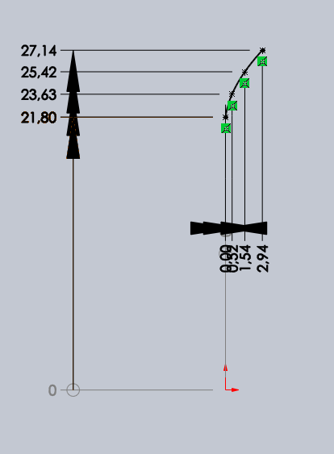{ width=8cm }

---

Skico tudi lahko narišeš z enačbo tools > sketch entities > equation driven curve.
V zgornjo enačbo za $x$ vstaviš vse not:

$$
    x = r * \sin{(\tan{(acos{(\frac{r_b}{r})}) - a * \cos{(\frac{r_b}{r})})}} \\
    y = r * \cos{(\tan{(acos{(\frac{r_b}{r})}) - a * \cos{(\frac{r_b}{r})})}} \\
$$

V solidworksu namesto $r$ vstaviš $t$

**Equation driven curve ne uporabljaj ker ga nemoreš v naslednjih korakih kopirat**

---

Nariši obodni in vznožni krog

{ width=8cm }

Podaljšaj evolvento do vznožnega kroga z črto

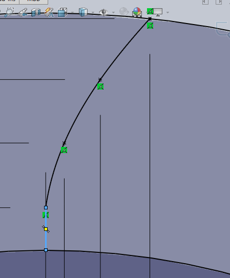{ width=8cm }

Nariši dve črte v V obliki in jih naredi "for construction"

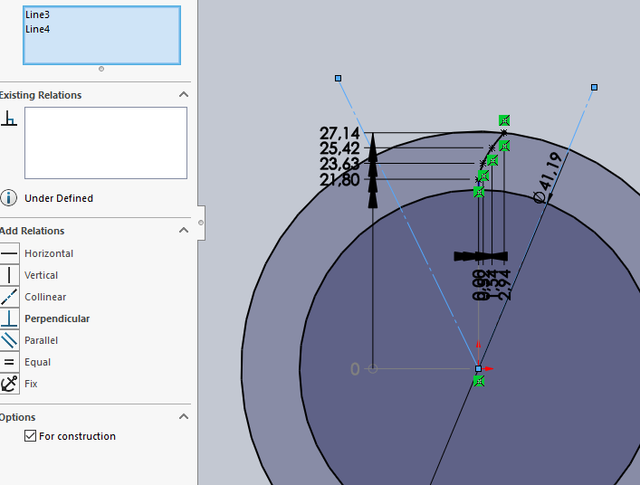{ width=8cm }

Obreži odvečne črte

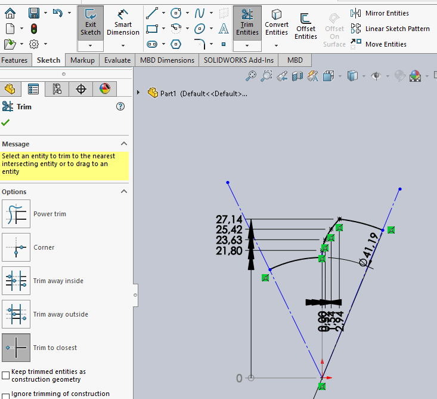{ width=8cm }

Narišemo pomožni delilni krog (for construction), ki ga nikamor ne fiksiramo, važno je, da je v centru.

{ width=8cm }

Dodaj zaokrožitev na dnu evolvente

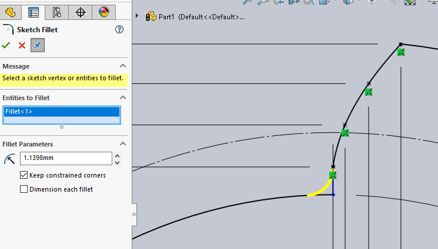{ width=8cm }

Dodaj dve točke in dodaj dimenzijo za ločno dolžino - smart dimension > klikni obdve točke > klikni krožnico

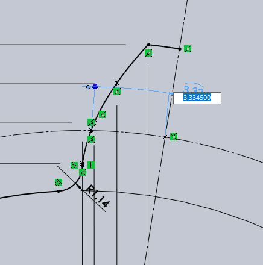{ width=8cm }

Definiraj kot med stranicami V-ja - kot je 360° / (2 * število zob)

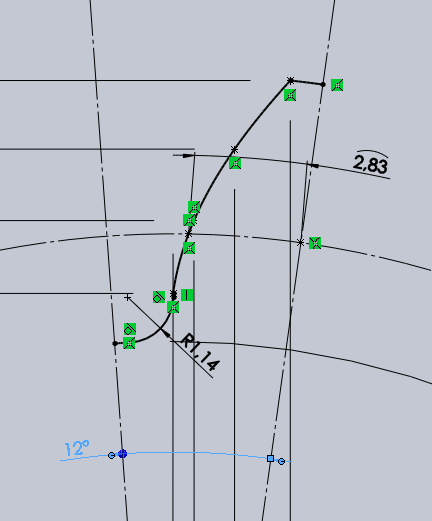{ width=8cm }

Prezrcali zobnik preko desne stranice > mirror entities

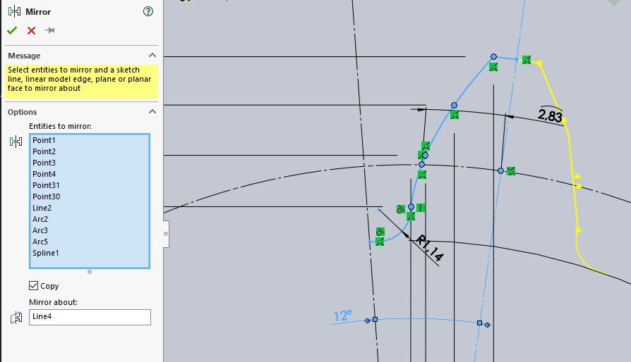{ width=8cm }

circular sketch pattern

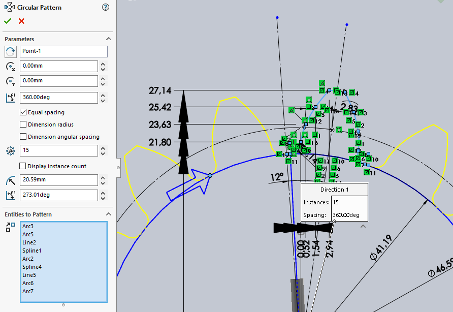{ width=8cm }

Preveri, če je skica zaprta z extrude. Izberi sketch in klikni extrude. Če kaj zajebava, pod selected contours klikni na sketch z desnim in clear selections, in še enkrat izberi konturo zobnika in potrdi

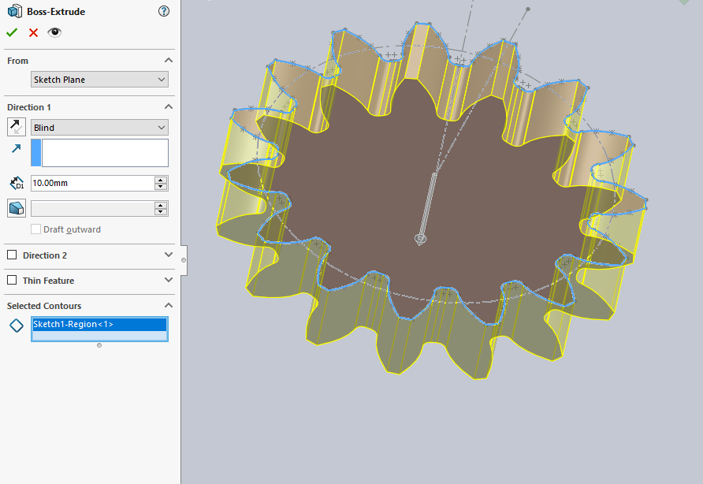{ width=8cm }

Naredi vijačnico za ekstrudiranje features > curves > helix and spiral. Nariši krog z premerom delilnega kroga (klikneš na črtkano črto) na isti ravnin kot zobnik. Zapri sketch in vijačnica bi se mogla izrisat.

Izračunaj podatke za vijačnico. $b = height$, $št.obr. = revolution$
$$
    št. obr. = {0.5 \over \pi * \tan{75 \deg}} = 0.0426 \\
    b = 0.5 * d = 23.2937 
$$

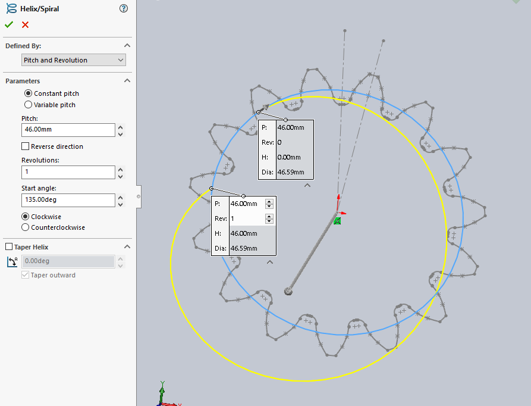{ width=8cm }

Z sweep extrude nariši zobnik. Za path izberi vijačnico, za profil pa izberi sketch zobnika. Zna zajebavat pri izbiri sketcha.

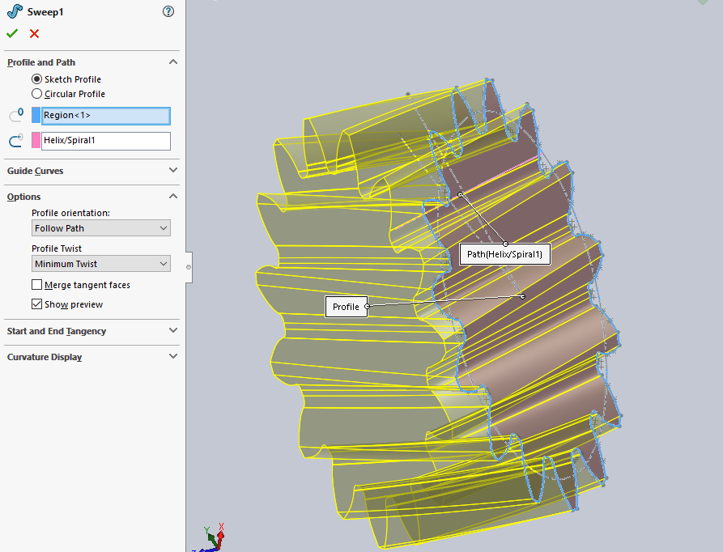{ width=8cm }

To je to. Svaka čast! Ponovi vajo za drugi zobnik
