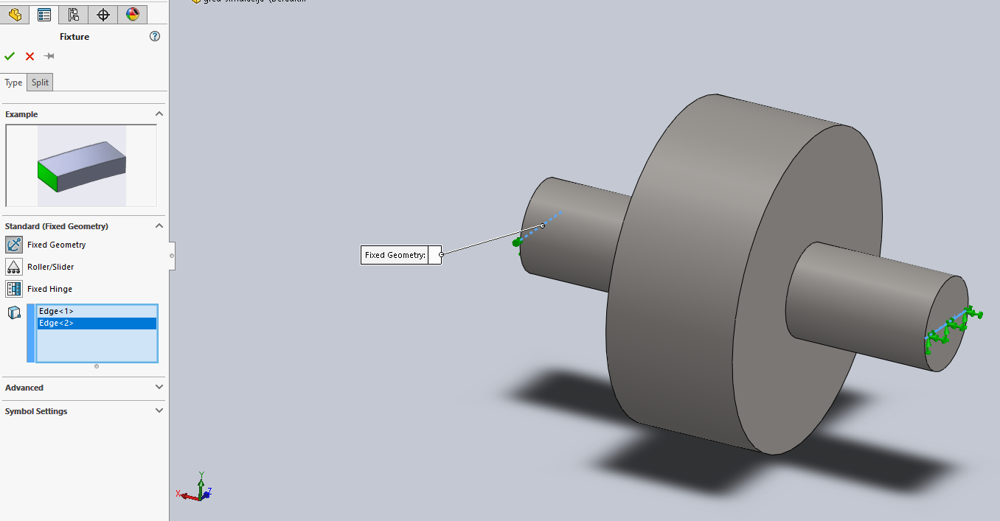

\maketitle
\tableofcontents
\newpage

# Animacija vrtenja zobnikov

Naredi ploščico za montažo zobnikov z dvemi pini. Premeri nimajo veze, glavno da je luknja na zobniku enaka premeru pina na ploščici. Razdalja med pini je razdalja med zobniki, v našem primeru 94 mm.

Iz ploščice naredi assembly in montiraj zobnike na pine. Ohišje fiksiraj z desnim klikom na njega > fix.

Zobnike na roke pravilno pozicioniraj.

Aktiviraj Solidworks Motion in na dnu okna izberi zavihek motion study.

Dodaj motor na notranji cilinder enega zobnika

Če zdej predvajaš animacijo, bi se mogu vrtet en zobnik. Če se ne, probaj v vrstici kliknit Calculate, da preračuna in ponovno predvajaj.

Zdej dodaj kontakt, da sam preračuna kontakt.

Še enkrat klikni da preračuna animacijo in mogli bi se obdva zobnika vrtit.

Plus za seminarsko je, da vključiš to analizo z grafi pospeškov in hitrosti.

# Kritična vrtilna hitrost in poves gredi s SW Simulation

Sestav gredi in zobnika nariši kot skico zobnika na brezmasni gredi. 

Nariši shemo zobnika in gredi kot na sliki in obvezno definiraj material.

Razdeli čelne ploskve, tam kjer so ležali na polovico tako, da nariši sketch na eni površini, ki seka ploskev. Nato izberi feautres > curves > split line in razdeli ploskve na obeh straneh na polovico.

Aktiviraj dodatek solidworks simulation, odpri zavihek simulation in klikni New Study in izberi Static za statično analizo.

Dodaj vpetje z Fixture advisor > Fixed geometry in izberi roba, ki smo jih prej narisali.

Dodaj še silo gravitacije External load advisor > Gravity 

In klikni Run this study in dobiš rezultate

To so rezultati za napetosti in povese pod lastno težo. Za analizo lastnih frekvenc naredi nov study in ponovi enake korake, samo **ne dodaj sile gravitacije**.

Zaženeš simulacijo in dobiš rezultate

Za animacijo greš na Plot tools > Animate in na vrhu izpiše lastno frekvenco. Za pravilno lastno frekvenco izberi tisto deformacijo, ki se giblje pravokotno na vpetje, kot na zgornji sliki gor in dol.

# Preračun mehanizma

Z podatki iz prejšnega predavanja nariši shemo mehanizma

$r = 0.1 m$ \
$\alpha = 45 \deg$ \
$L = 0.25 m$ \
$x = 0.05 m$ \
$n = 2000 \frac{obr}{min}$

Dodaj še ostale dele - ojnica, cilinder bat in jih pravilno mate-aj. Pazi na dele ki morajo biti kocentrični, fiksni itd. Ko končaš bi se morala gred prosto vrteti in bat premikati po cilindru.

Pazi da je gred obrnjena v pravi poziciji, pod 45 stopinj!

