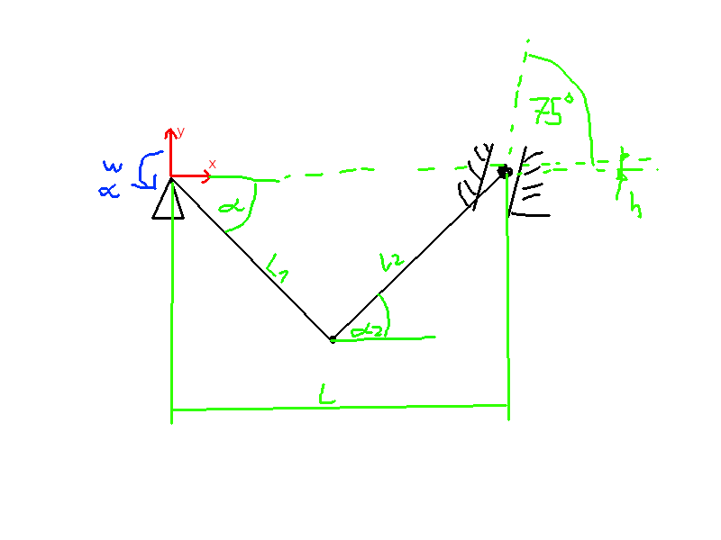

\maketitle
\tableofcontents
\newpage

# O prostostnih stopnjah mehanizma

Togo telo ima:

* V prostoru 6 prostostnih stopenj,
* v ravnini pa 3 prostostne stopnje.

## Primer izračuna prostostnih stopenj mehanizma

Imamo 4 točkovni mehanizem v obliki paralelograma. Spodnje dve točke so vpete v podpore, zgornje dve pa so proste.

Grueberjev kriterij:

* ravninsko:

$$
    m = 3 * (n - 1) - 2 * j_1 - 2 * j_2
$$

$n$ - število teles \
$j_1$ - število povezav z eno prostostno stopnjo \
$j_2$ - število povezav z dvema prostostnima stopnjama

Za naš primer:

$$
    m = 3 * (4 - 1) - 2 * 4 - 0 \\
    m = 1
$$

Če je $m > 0$ imamo mehanizem, če je pa $m = 0$ pa je statično določena konstrukcija. Če je $m < 0$ pa imamo statično predoločeno ali nedoločeno konstrukcijo.

V statično predoločenih ali nedoločenih konstrukcijah vključujemo v sistem deformacijske enačbe.

# Primer Tabele za 2. seminarsko

| | $v_x^a$ | $v_x^s$ | ${v_x^a - v_x^s \over v_x^a} * 100\%$ | $v_y^a$ | $v_y^s$ | ${v_y^a - v_y^s \over v_y^a} * 100\%$ | $a_x^a$ | $a_x^s$ | ${a_x^a - a_x^s \over a_x^a} * 100\%$ | $a_y^a$ | $a_y^s$ | ${a_y^a - a_y^s \over a_y^a} * 100\%$ |
| --- | --- | --- | --- | --- | --- | --- | --- | --- | --- | --- | --- | --- |
| Točka B | -14,87 | -14,81 | 0,4% | | | | -3114,42 | 3101,7  | 0,4% | | | |
| Točka C | | | | | | | | 0 | | | 3730,3 | |

# Primer mehanizma za izpit

$v_{ax} = 0$ \
$v_{ay} = 0$ \
$\omega_{B|A} = 0$ \
$\alpha_{B|A} = 100 rad/s$ \
$r_{B|A_x} = L_1 * \cos{-45 \deg} = 0,707 m$ \
$r_{B|A_y} = L_1 * \sin{-45 \deg} = 0,707 m$ \
$L_1 = 1 m$ \
$L_2 = 1 m$ \
$L = 1,2 m$ 

Iz dolžin izračunam še pozicijo točke C glede na B

$$
    L_1 * \cos{-45 \deg} + L_2 * \cos{\alpha_2} = L \\
    \alpha_2 = \arccos{L - L_1 * \cos{-45 \deg} \over L_2} \\
    \alpha_2 = \arccos{1,2 - 0,707 \over 1} \\
    \alpha_2 = 60,46 \deg 
$$

$$
    r_{B|C_x} = L_2 * \cos{60,64 \deg} = 0,493 \\
    r_{B|C_y} = L_2 * \sin{60,64 \deg} = 0,870
$$

$$
    v_{Bx} = \sout{v_{Ax}} - \sout{\omega_{B|A}} * r_{B|A_y} = 0 \\
    v_{By} = 0 \\
    v_{Cx} = 0 \\
    v_{Cy} = 0
$$

## Dokažemo da mehanizem miruje

$$
    \underline{v_{Cx}} = v_{Bx} - \underline{\omega_{C|B}} * r_{C|B_y} \\
    \underline{v_{Cy}} = v_{By} - \omega_{C|B} * r_{C|B_x}
$$

2 enačbe, 3 neznanke, sistem ni rešljiv brez ene posebne enačbe, ki se pojavi v primeru, ko je drsnik postrani. **Ne vemo točne hitrosti v tej točki, vemo pa razmerja med komponentami $x$ in $y$ smeri.**

$$
    v_{cx} = v * \cos{75 \deg} \\
    v_{cy} = v * \sin{75 \deg} \\
    \\
    {v_{cx} \over v_{cy}} = {\cos{75 \deg} \over \sin{75 \deg}}
$$

To enačbo vstavimo v zgornje.

$$
    v_{cx} = v_{cy} * {\cos{75 \deg} \over \sin{75 \deg}} \\
    v_{cy} * {\cos{75 \deg} \over \sin{75 \deg}} = -\omega_{C|B} * r_{C|B_y} \\
    v_{cy} = \omega_{C|B} * r_{C|B_x}
$$

Dve enačbe, dve neznanke. Spodnjo vstavimo v zgornjo.

$$
    w_{C|B} * r_{C|B_x} * {\cos{75 \deg} \over \sin{75 \deg}} = -\omega_{C|B} * r_{C|By} \\
    w_{C|B} * 0,493 * 0,268 = -\omega_{C|B} * 0,870
$$

Edina rešitev zgornje enačbe je: $\omega_{C|B} = 0$

## Pospeški

### Točka B

$$
    a_{Bx} = \sout{a_{Ax}} - \alpha_{B|A} * r_{B|A_y} - \sout{\omega_{B|A}^2} * r_{B|A_x} \\
    a_{Bx} = -100 s^{-1} * (-0,707 m) = + 70,7 \frac{m}{s^2} \\
    \\
    a_{By} = \sout{a_{Ay}} - \alpha_{B|A} * r_{B|A_x} - \sout{\omega_{B|A}^2} * r_{B|A_y} \\
    a_{By} = + 100s^{-1} * (+0,707) = + 70,7 \frac{m}{s^2}
$$

### Točka C

$$
    a_{Cx} = \underline{a_{Bx}} - \underline{\alpha_{C|B}} * r_{C|B_y} - \sout{\omega_{C|B}^2} * r_{C|B_x} \\
    a_{Cy} = \underline{a_{By}} - \alpha_{C|B} * r_{C|B_x} - \sout{\omega_{C|B}^2} * r_{C|B_y} \\
$$

Enačbe premečemo kako čemo i znamo.

$$
    a_{Cy} = \frac{a_{Cx}}{\cos{75 \deg}} * \sin{75 \deg}
$$

$$
    \underline{a_{Cx}} = a_{Bx} - \underline{\alpha_{C|B}} * r_{C|B_y} \\
    \underline{a_{Cx}} * \frac{\sin{75 \deg}}{\cos{75 \deg}} = a_{By} - \underline{\alpha_{C|B}} * r_{C|B_x}
$$

Vstavimo eno enačbo v drugo

$$
    a_{Cx} * \frac{\sin{75 \deg}}{\cos{75 \deg}} = a_{By} + \frac{a_{Bx} - a_{Cx}}{r_{C|B_y}} * r_{C|B_x} \\
    a_{Cx} * \frac{\sin{75 \deg}}{\cos{75 \deg}} =  a_{By} + \frac{a_{Bx}}{r_{C|B_y}} * r_{C|B_x} - \frac{a_{Cx}}{r_{C|B_y}} * r_{C|B_x} \\
    a_{Cx} * (\frac{\sin{75 \deg}}{\cos{75 \deg}} + \frac{r_{C|B_x}}{r_{C|B_y}}) = a_{By} + \frac{a_{Bx}}{r_{C|By}} * r_{C|B_x} \\
    a_{Cx} = {70,7 + \frac{70,7 \over 0,870} * 0,493 \over \frac{\sin{75 \deg}}{\cos{75 \deg}} + \frac{0,493}{0,870}} = 25,767 \frac{m}{s^2}
$$

$$
    a_{cy} = a_{cx} * \frac{\sin{75 \deg}}{\cos{75 \deg}} \\
    a_{cy} = 96,164 \frac{m}{s^2}
$$

