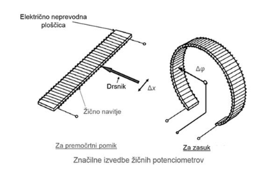
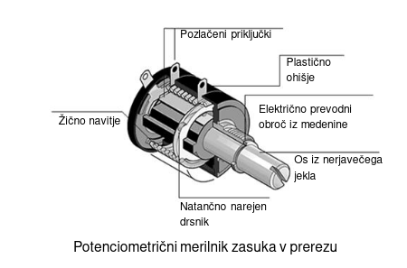
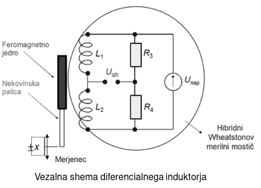
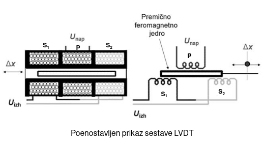
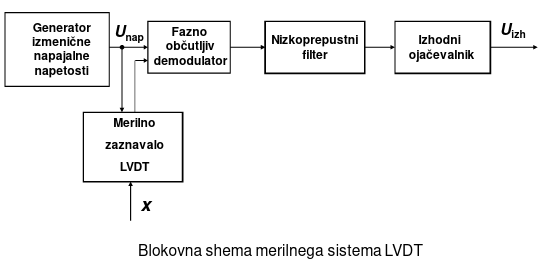
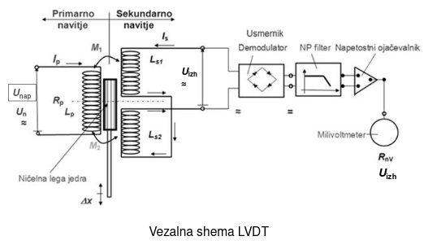
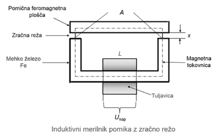

\maketitle
\tableofcontents
\newpage

# Iztočnice
## Uporovno merjenje pomikov

Potenciometer ali reostat je zelo pogost sestavni gradnik v elektrotehniki.

Potenciometri ali delilniki električne napetosti v posebni izvedbi so razmeroma preprosta ter cenena rešitev za merjenje predvsem premočrtnih pomikov.

Spreminjanje električne upornosti na potenciometru zagotavlja, da se električna napetost na njem in električni tok, ki gre čez njega nadzoruje v skladu z Ohmovim zakonom.

{ width=8cm }

Potenciometri so glede na delovanje in izvedbo razvrščeni v tri vrste:

* linearni potenciometer,
* rotacijski potenciometer,
* digitalni potenciometer.

Poznamo:

* Žične in
* polprevodniške potenciometre

Ločljivost žičnih potenciometrov za razliko od polprevodniških je omejena, imajo pa žični potenciometri boljšo linearnost.

Žični potenciometri so manj občutljivi na spremembe temperature zraka (v okolici merilnega mesta) kot polprevodniški potenciometri, ki so narejeni iz električno prevodnega polimera.

Potenciometrični merilniki so pasivni in za svoje delovanje potrebujejo kontrolirano tokovno napajanje.

Sodobni polprevodniški potenciometri za premočrtne pomike dosegajo:

* merilno točnost do ±0,01% MR,
* ločljivosti od 0,0002 mm do 0,0005 mm,
* histerezo manjšo kot 0,5%,
* najvišje hitrosti pomikanja drsnika do 1 m/s.

Če merimo izhodno električno napetost $U_{izh}$ potenciometra z nizkouporovnim voltmetrom, izmerek ni povsem premosorazmeren s pomikom drsnika ali merjenca x.

Pomanjkljivosti potenciometričnih merilnikov za pomike so predvsem v omejenem merilnem razponu, v obremenitvi zaradi trenja, poslabšani nelinearnosti zaradi bremena, v obrabi in potrebi po stabilnem napajanju.

## Uporovno merjenje zasukov

{ width=8cm }

Z vijačno obliko pridobimo na ločljivosti in merilni točnosti, saj lahko dosežemo relativne merilne točnosti tudi do 0,01 % merjenega zasuka.

## Induktivno merjenje pomikov

Najpogosteje dosegljivi merilniki so namenjeni za premočrtne ter rotacijske pomike ali zasuke.

Najpomembnejša področja uporabe induktivnih merilnih zaznaval npr. za pomike so:

* pozicijsko krmiljenje in nastavitev orodji,
* vodenje industrijskih robotov,
* vodenje izdelovalnih strojev in naprav.

Induktivni merilniki, ki se uporabljajo za merjenje pomikov pogosto delujejo po različnih načelih in metodah, s katerimi zmanjšamo učinek motilnih magnetnih polj ter kompenziramo vpliv temperature.

To so zelo zanesljivi in trajni merilniki, katerih delovanje je brezdotikalno. Imajo dolgo dobo trajanja, so zelo robustni, prenesejo zelo visoke obremenitve in imajo zelo dobre dinamične značilnosti.

Povezava med premikajočimi ter mirujočimi deli induktivnih merilnikov poteka preko magnetnega pretoka.

Potrebujejo pa posebno izmenično napajanje in usmerjanje ali demodulacijo izmenične izhodne napetosti.

Induktivne merilnike velikokrat uporabljamo za merjenje premočrtnih pomikov v ožjih merilnih območjih kot npr. od 0 do 0,001 mm ter od 0 do 1 m.

**Temeljne prednosti induktivnih merilnikov** za pomike so torej:

* majhen vpliv na merjenec,
* zelo kratek časovni odziv,
* nizka izhodna električna upornost ter
* preprosta in zanesljiva sestava.

Temeljni in primarni sestavni element induktivnih merilnikov je električna tuljavica, ki generira izmenično magnetno polje.

Razlikovati pri tem moramo induktivno tuljavico z zračnim magnetnim jedrom od induktivne tuljavice z feromagnetnim jedrom.

V splošnem induktivne merilnike za premočrtne pomike delimo v dve skupini in jih poznamo kot:

* diferencialne induktorje in
* diferencialne transformatorje.

### Diferencialni induktor

Napajanje diferencialnega induktorja je izmenično pri čemer je oblika spremembe napajalne napetosti sinusna s frekvenco od 60 Hz do 50 kHz.

{ width=8cm }

Induktivni merilnik v takšni izvedbi posebej uporabljamo za merjenje premočrtnih pomikov v omejenih manjših merilnih razponih od 0 do 0,01 mm ter od 0 do 1 mm.

Ločljivost diferencialnega induktorja pa je predvsem odvisna od občutljivosti ter ločljivosti milivoltmetra za merjenje izhodne napetosti.

### Diferencialni transformator LVDT

Delovanje LVDT temelji na vzajemni magnetni induktivnosti med primarnim in sekundarnim navitjem treh tuljav medtem, ko se znotraj magnetnega polja pomika feromagnetno jedro.

Diferencialni transformator sestavljajo torej valjasta cevka, magnetne tuljavice in premično jedro iz mehkega železa.

{ width=8cm }

Če premikamo feromagnetno jedro oz. merjenec se v tuljavicah spreminja magnetna upornost in zato tudi induktivnost navitja, saj poteka več ali manj magnetnih silnic po zraku ali po mehkem železu.

Ko feromagnetno jedro oz. merjenec premaknemo za x magnetni stik z enim sekundarnim navitjem narašča, z drugim pa upada in se zato spremeni izhodna napetost $U_izh$.

**Demodulator** je naprava, ki iz višjega frekvenčnega pasu signal preslika nazaj v osnovni pas. Postopek demodulacije je inverzen postopku modulacije

{ width=8cm }

{ width=8cm }

**Temeljne prednosti LVDT** kot merilnika pomikov so:

* majhen vpliv na merjeni sistem,
* nizka izhodna električna upornost ter
* preprosta in zanesljiva sestava.

Z dovolj občutljivim merjenjem izhodne napetosti je z LVDT možno zaznati premočrtne časovno odvisne pomike velikostne stopnje nanometra.

# Vprašanja in odgovori

### V sliki in besedi pojasnite delovanje in meroslovne značilnosti potenciometričnega merilnika premočrtnih pomikov.

Delujejo na principu spremembe upornosti z pomikanjem drsnika po slabo prevodni površini. Potenciometrični merilniki so pasivni in za svoje delovanje potrebujejo kontrolirano tokovno napajanje.

{ width=8cm }

Poznamo:

* Žične in
* polprevodniške potenciometre

Ločljivost žičnih potenciometrov za razliko od polprevodniških je omejena, imajo pa žični potenciometri boljšo linearnost.

### Pojasnite v sliki in besedi na kakšen način zagotavljamo linearnost potenciometričnega merilnika premočrtnih pomikov.

* Drsnik mora biti narejen iz kakovostnih materialov, s čimer se zmanjša trenje, obraba ter kontaktna električna upornost.
* Vpliv trenja pri pomikanju drsnika naj bo čim manjši.
* Ločljivost žičnih potenciometrov za razliko od polprevodniških je omejena, imajo pa žični potenciometri boljšo linearnost.

### Narišite vezalno shemo induktivnega merilnika pomikov na zračno režo ter pojasnite njegovo delovanje ter prednosti in omejitve.

{ width=8cm }

### V sliki in besedi pojasnite delovanje in značilnosti diferencialnega induktorja za merjenje premočrtnih pomikov.

Napajanje diferencialnega induktorja je izmenično pri čemer je oblika spremembe napajalne napetosti sinusna s frekvenco od 60 Hz do 50 kHz.

{ width=8cm }

Uporabljamo ga za merjenje premočrtnih pomikov v omejenih manjših merilnih razponih od 0 do 0,01 mm ter od 0 do 1 mm.

Ločljivost diferencialnega induktorja pa je predvsem odvisna od občutljivosti ter ločljivosti milivoltmetra za merjenje izhodne napetosti.

### Narišite poenostavljeno vezalno shemo diferencialnega transformatorja - LVDT in pojasnite delovanje ter merilno-tehnične značilnosti tovrstnega merilnika premočrtnih pomikov.

{ width=8cm }

Delovanje LVDT temelji na vzajemni magnetni induktivnosti med primarnim in sekundarnim navitjem treh tuljav medtem, ko se znotraj magnetnega polja pomika feromagnetno jedro.

Ko feromagnetno jedro oz. merjenec premaknemo za x magnetni stik z enim sekundarnim navitjem narašča, z drugim pa upada in se zato spremeni izhodna napetost $U_izh$.

**Temeljne prednosti LVDT** kot merilnika pomikov so:

* majhen vpliv na merjeni sistem,
* nizka izhodna električna upornost ter
* preprosta in zanesljiva sestava.