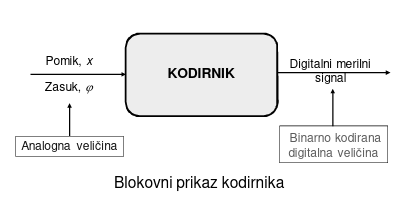
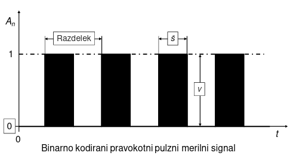
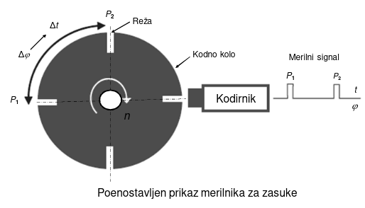
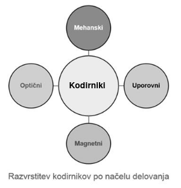
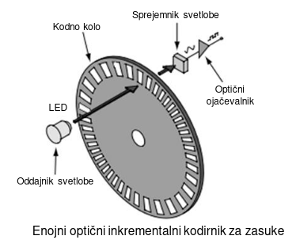
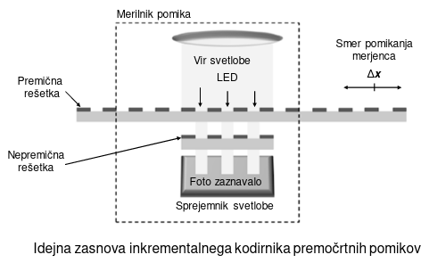
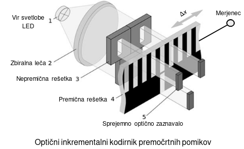
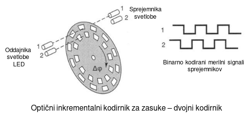
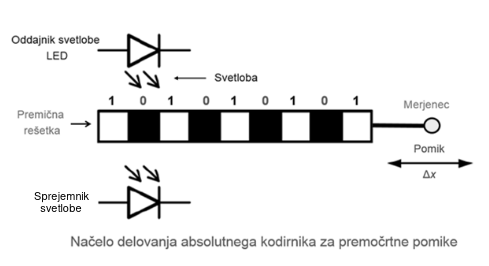

\maketitle
\tableofcontents
\newpage

# Kodirniki za merjenje pomikov in zasukov

Kodirnik ali enkoder je merilna naprava, ki lahko pretvarja podatke iz enega formata v drugega.

Kodirniki imajo pomembno vlogo v skoraj vsakem mehanskem sistemu, ki vključuje spremljanje ali nadzor gibanja ter vrtenja merjenca.

Pri zaznavanju položaja ter gibanja merjenca kodirnik lahko zazna in spremeni mehansko gibanje merjenca v analogni ali digitalni binarno kodirani merilni signal na izhodu iz merilne verige.

Preprosto povedano, beležijo meritve gibanja in jih sporočajo na način, ki ga lahko nadzorni sistem in/ali oseba uporabi za prilagajanje ter spremljanje procesa.

{ width=8cm }

Kodirnik ali enkoder je sklopljena elektro-mehanska merilna naprava, ki spreminja premočrtne pomike merjenca ali pa zasuke osi in gredi v digitalni binarno kodirani merilni signal.

Binarno kodirani merilni signal je najbolj pogosta oblika digitalnega merilnega signala.

{ width=8cm }

Kodirnik je brez dotikalni, optoelektronski ali magnetno delujoči merilnik premočrtnih pomikov in zasukov. Prenosni medij ali nosilec generiranih merilnih signalov je svetlobno ali magnetno polje.

Kodirnike glede na vrsto gibanja merjenca razvrščamo kot:

* linearne in
* rotacijske

Linearni kodirnik je nameščen na merjenec in ko se merjenec premakne, kodirnik zazna premaknjen pomik.

Kodirnik za zasuke je merilna naprava, ki spremembo kota pri zasukih oz. rotacijskih pomikih spremeni v električne digitalne veličine ali pravokotne digitalne pulze.

{ width=8cm }

**Pulzni signal** ima končno širino in končno amplitudo, kot npr. pravokoten pulz in je definiran v končnem časovnem intervalu.

**Impulz** je definiran, ko se širina pulza skrči s časovno bazo, in se nagiba k ničelnemu širjenju, amplituda merilnega signala pa gre v neskončnost.

{ width=8cm }

**Inkrementalni kodirniki** merijo pomik ali zasuk glede na neko začetno referenčno točko.

**Absolutni kodirniki** v celotnem času uporabe prepoznajo prejšnjo lokacijo.

Namesto enakomerno razmaknjenih zarez, ločene sledi ali oznake posredujejo edinstveno kodo na vsaki lokaciji krmilni enoti, ki nadzoruje merilni proces.

### Inkrementalni kodirniki

Inkrementalni kodirniki npr. za merjenje premočrtnih pomikov in zasukov temeljijo na štetju rastrskih razdelkov ali pulzov. Po enem polnem vrtljaju zasuka gredi dajejo točno določeno število pravokotnih pulzov.

{ width=8cm }

Inkrementalni kodirnik si po izpadu napajanja oz. delovanja ne zapomni zadnje lege merjenca.

## Linearni inkrementalni kodirniki

Linearni inkrementalni kodirniki pomikov so namenjeni za merjenje premočrtnih pomikov merjenca oz. lege merjenca. 

Linearni optični inkrementalni kodirniki pomikov imajo dve rešetki. Ena rešetka je nepremična in se imenuje referenčna rešetka, druga pa je premična in se imenuje merilna rešetka.

Premična rešetka sledi pomiku merjenca in je na nek način “optično deformirana ali popačena”, medtem ko ostaja druga nepremična rešetka nespremenjena ter predstavlja referenco.

{ width=8cm }

{ width=8cm }

S premikanjem rešetke z zarezami in presledki enake širine se sinusno spreminja osvetljenost in posledično izhodna napetost sprejemnega optičnega zaznavala.

## Tahometer

Posebno izvedbo inkrementalnega kodirnika v obliki enojnega kodirnika, pogosto imenujemo tudi merilnik vrtljajev oz. merilnik vrtilne hitrosti ali tahometer.

Tahometer ima en izhodni merilni signal in se uporablja v primeru, ko imamo samo eno smer vrtenja.

## Kvadraturni kodirnik

Kvadraturni kodirnik ima dve vrsti izsekov, ki sta med seboj fazno zamaknjeni za 90º in imata enako ločljivost. Na ta način se pomembno izboljša ločljivost kodirnika.

{ width=8cm }

Uporabljamo jih v bolj zahtevnih primerih, ker z dvema izhodnima signaloma lahko ugotovimo tudi smer vrtenja.

Za natančnejše meritve moramo doseči visoko ločljivost, ki pa je odvisna od števila izsekov na kodnem kolesu.

Pri kovinskih kodnih kolesi je problem v natančnosti izdelave izsekov (enakost izsekov) ter število izsekov na en vrtljaj (ločljivost).

## Zaključek

Najvišja ločljivost danes tržno dosegljivega sodobnega optičnega kodirnika za zasuke je 29 bitov, kar pomeni, da je za spremembo enega bita potreben zasuk za 0,67x10-6 stopinje.

Kodirnik tudi zaznava pomike pri vrtilni hitrosti do 40.000 min-1 in delujejo v območju od -25 °C do +70 °C ter pri visokih pospeških, ki so celo višji od 20×g.

V svetovnem merilu uveljavljena domača tovarna za izdelavo magnetnih inkrementalnih ter absolutnih kodirnikov za premočrtne pomike ter zasuke je: RLS Merilna tehnika, d.o.o. Komenda SLOVENIJA

## Vprašanja in odgovori

## V čem se razlikujeta inkrementalni in absolutni kodirnik?

Razliko med inkrementalnim in absolutnim kodirnikom lahko pojasnimo kot razliko med štoparico in uro.

Štoparica meri relativni čas, ki preteče med začetkom in koncem štopanja, na ta način določimo čas tako, da podamo vrednost pretečenega časa.

Po drugi strani ura prikazuje točen trenutni čas v enem dnevu.

Podobno kot pri štoparici inkrementalni kodirnik kaže relativni položaj in smer gibanja z dodajanjem inkrementalnih pulzov znanemu začetnemu položaju. 

Rotacijski inkrementalni kodirniki imajo posebne oznake ali reže na merilni lestvici ali kodnem kolesu, ki so enakomerno razmaknjene.

## Katere so splošne značilnosti absolutnih kodirnikov?

Glavna prednost absolutnega kodirnika je, da se po vklopu napajanja takoj pridobi informacija o trenutnem položaju merjenca.

V primerjavi z inkrementalnimi kodirniki teh kodirnikov ni treba premakniti v referenčni položaj.

Absolutni kodirniki uporabljajo kodirane postopke z absolutnim merilom. Položaj merjenca je tako neposredno kodiran v digitalni obliki, zato je tudi izhod tovrstnih merilnikov neposredno v digitalni obliki.

Kodirniki so zato pogosto montirani kar na gred pogonskega motorja, lahko pa so na gredi gnanega dela stroja.

{ width=8cm }

Absolutni kodirniki so bolj zanesljivi ter tudi dražji od inkrementalnih, zato jih uporabljamo tam kjer so meritve pomika lahko odločilnega pomena npr. v sistemih za zagotavljanje življenjske varnosti ljudi in premoženja.

## Kakšna je razlika med magnetnim in optičnim kodirnikom?

Razlika med magnetnimi in optičnimi kodirniki je v načinu, kako kodirniki prepoznajo in obdelujejo različna kodiranja ali oznake.

Magnetni kodirniki uporabljajo razmerje med statičnimi in/ali dinamičnimi magnetnimi polji ter ločenimi merilnimi skalama ali lestvicama in jih prevedejo v merilne signale.

Druga pogosta izvedba kodirnikov je optična, ki uporablja svetlobo, ki prehaja skozi kodno kolo in jo prepozna sprejemnik.

Magnetni kodirniki so na splošno bolj preprosti, kompaktni in vzdržljivi, medtem ko so optični kodirniki izjemno natančni in lahko nemoteno delujejo na območjih z drugimi magnetnimi silami ter polji.